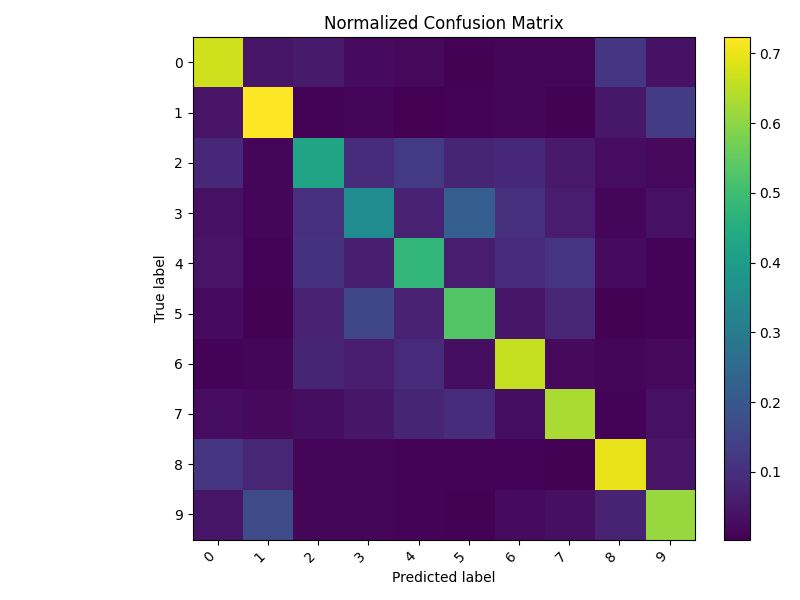
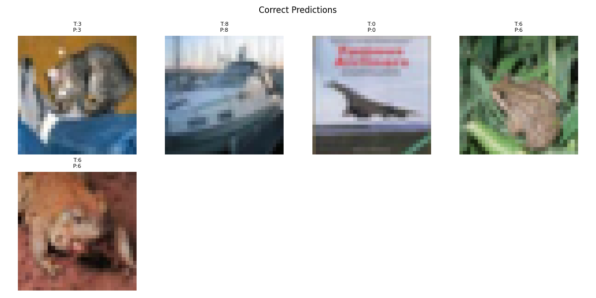
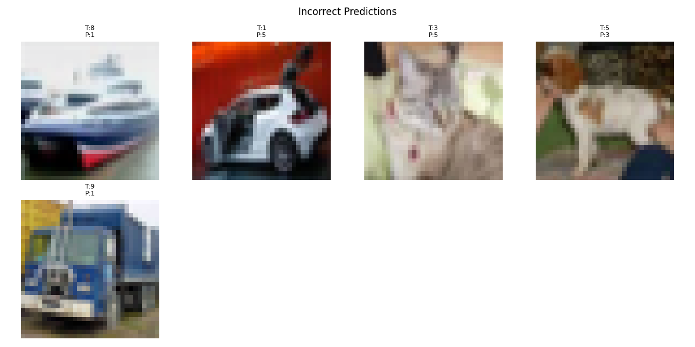
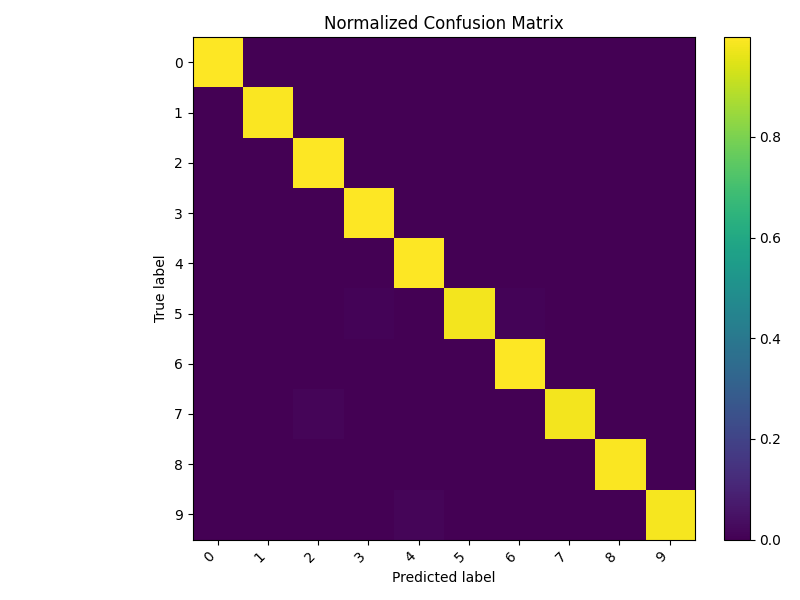
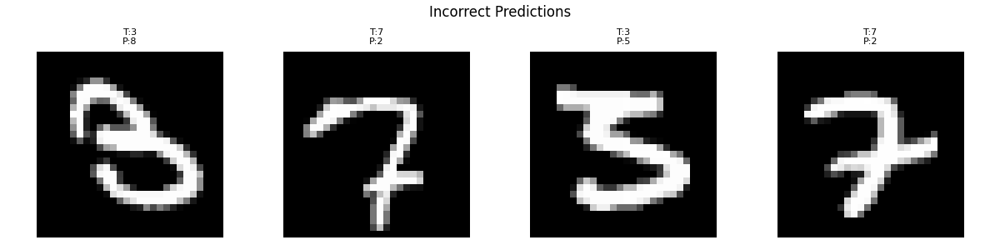

# Part A

This part implements and trains CNN models (e.g. VGG and ResNet) on image classification datasets, and evaluates them with accuracy and per-class metrics.

---

## 1. Dataset preparation

For Part A **you do not need to manually download or unpack any dataset**.

* The datasets **MNIST** and **CIFAR-10** are created using `torchvision.datasets` inside the Jupyter notebook / scripts.
* When you run the code for the first time, `torchvision` will automatically download the data into the configured folder  `../dataset` relative to `partA`.

---

## 2. start environment

1. Activate the environment (if not already):

   ```bash
   conda activate assign1
   ```

2. Start Jupyter from the project root or from the `partA` folder using vscode:

   ```bash
   cd Assignment1/partA
   ```

3. In the PartA:

   * **Model definition** is in `model.py` (`VGG.SimpleVGG`, `ResNet`).
   * **Training logic** is in `train.py` (`train_model()`).
   * **Evaluation & visualisation** is in `test.py` (`evaluate_model()`).

   The typical workflow is:

   1. Run the import and dataset preparation cells.
   2. Call `train_model()` for a chosen model (VGG / ResNet) and hyperparameters
      (learning rate, batch size, number of epochs).
   3. After training finishes, call `evaluate_model()` with:

      * `model`,
      * `checkpoint_path` (best model `.pth` path saved by training),
      * `test_dataset`, to compute accuracy, per-class F1-score, confusion matrix, and visualisations.

---

## 4. Outputs and logs

* During training, logs and plots are saved under:

  ```text
  ./logs/<experiment_name>/
  ```

  including:

  * training / test loss curves,
  * test accuracy vs. epoch,
  * the best model checkpoint: `model_best.pth`.

* During evaluation, additional files are saved under:

  ```text
  ./logs/<experiment_name>/test_results/
  ```

  including:

  * `test_metrics.txt` – overall accuracy, macro F1, per-class metrics (from `sklearn`),
  * `confusion_matrix.png` – confusion matrix visualisation,
  * `correct_examples.png` – examples of correctly classified images,
  * `incorrect_examples.png` – examples of misclassified images.

---

## 5. How to run code
### CIFAR10_train
Run code blocks in CIFAR10_train.ipynb one by one

### MNIST_train
Run code blocks in MNIST_train.ipynb one by one


---

## 6. Hyperparameter comparison(3050ti)
### CIFAR10_train
| Exp ID | Model     |  Epochs | Learning Rate | Batch Size | Train Time (s) | Test Time (s) | Accuracy | Macro F1-score |
|--------|-----------|---------|---------------|------------|----------------|---------------|----------|----------------|
| 1      | SimpleVGG |    17     |       1e-3        |      64      |       895.17         |       3.88        |    0.8480      |       0.8471         |
| 2      | SimpleVGG |    30     |       1e-5        |      64      |       1627.04         |      2.80         |   0.7630       |      0.7618          |
| 3      | ResNet50  |    24     |       1e-3        |      64      |     2798.86           |      7.56         |    0.8050      |      0.8050          |
| 4      | ResNet50  |    60     |       1e-5        |      64      |     5990.14           |      4.51         |    0.5786      |       0.5752         |

### MNIST_train
| Exp ID | Model     |  Epochs | Learning Rate | Batch Size | Train Time (s) | Test Time (s) | Accuracy | Macro F1-score |
|--------|-----------|---------|---------------|------------|----------------|---------------|----------|----------------|
| 1      | SimpleVGG |    9     |       1e-3        |      64      |       640.42         |       2.98        |    0.9917      |       0.9917         |
| 2      | SimpleVGG |    16     |       1e-5        |      64      |       1083.98         |      2.29         |   0.9924       |      0.9924          |
| 3      | SimpleVGG |     7    |       1e-5        |      1      |       18538.59        |       33.80        |     0.9902     |        0.9902        |
| 4      | ResNet50  |    17     |       1e-3        |      64      |     2705.91           |      8.64        |    0.9914      |      0.9913          |
| 5      | ResNet50  |    20     |       1e-5        |      64      |     1451.07          |      4.39         |    0.9667      |       0.9664         |


## 7. Result
### CIFAR10_train



### MNIST_train



